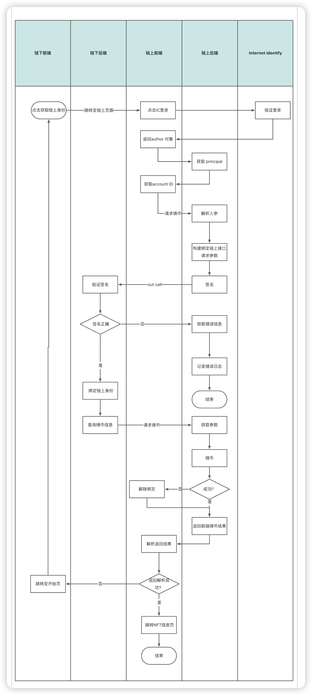
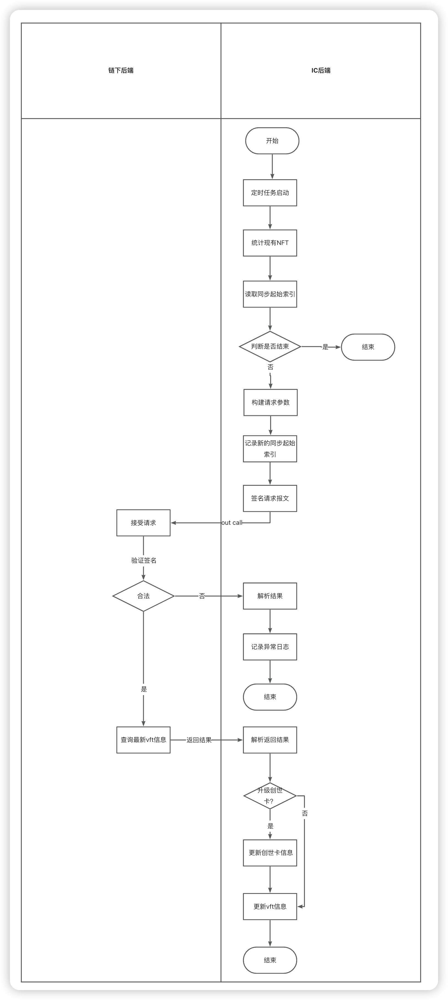

# VFANS-IC

> - 基于IC的NFT 智能合约。通过outCall 同步NFT 信息。
> - 支持通过Oauth2的授权方法获取用户IC链上身份并绑定vfans账户信息。
> - NFT 永久且独立存在，不可伪造，包含用户在Vfans上的资产信息。不支持转让
> - 通过定时功能每日更新NFT信息
> - 提供了内置账单功能
>   - 可以实时查看当前cansiter的cycles余额
>   - 可以查看每日cycles消耗

## 介绍

本项目链接了链上与链下。通过使用Motoko 语言来编写智能合约。基于Motoko的特性实现数据链上的永久存储。

- 铸币流程图

  
  
  - 同步数据流程
  
    
  
    

## 部署流程

### 部署环境

- dfx sdk
- Npm

开始部署

A step-by-step guide to installing the project, including necessary configuration etc.

```bash
$ git clone https://github.com/VFans-org/VFANS-IC-Public
$ cd VFANS-IC-Public
$ npm install
# 本地部署
$ sh deploy-local all 
# 主网部署 需要cycles
$ sh deploy
```

## 前端页面

https://5tqw5-6yaaa-aaaal-ai4va-cai.icp0.io/

### 示例1 通过ic_account_id 查看NFT信息

```bash
$ dfx canister call nft_backend queryNfts '("your ic_account_id")'
```

### 示例2 查看当前Cycle 余额 

```bash
dfx canister call nft_backend query_balance '()'
```

### 示例3 查看账单

```ba
dfx canister call nft_backend query_cycles_ledger '()'
```

## 文档


## 测试

暂无

## Roadmap

暂无

## 开源许可

此项目是根据麻省理工学院许可证授权的，请参阅license.md了解详细信息。有关如何对此项目做出贡献的详细信息，请参阅CONTRIBUTE.md。

## 致谢

- Hat tip to anyone who's code was used
- External contributors
- Etc.

## References

- [Internet Computer](https://internetcomputer.org)
- Etiam dolor ante
- Nullam iaculis risus vitae
